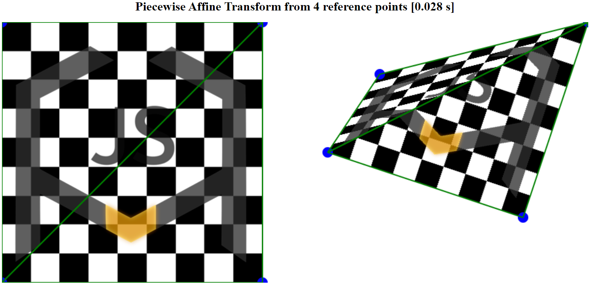
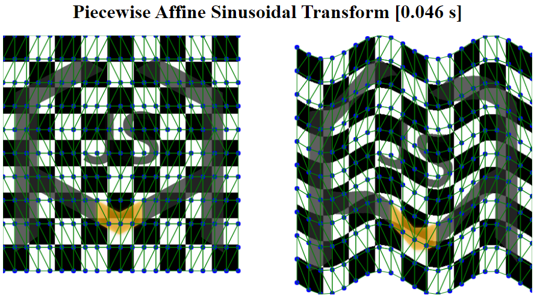
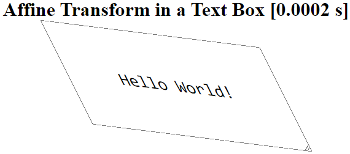

#  Homography.js
 Homography.js is a lightweight <a href="#performance">High-Performance</a> library for implementing homographies in Javascript or Node.js. It is designed to be easy-to-use (even for developers that are not familiar with Computer Vision), and able to run in real time applications (even in low-spec devices such as budget smartphones). It allows you to perform <a href="https://en.wikipedia.org/wiki/Affine_transformation" target="_blank">Affine</a>, <a href="https://en.wikipedia.org/wiki/Homography" target="_blank">Projective</a> or <a href="https://en.wikipedia.org/wiki/Piecewise_linear_function" target="_blank">Piecewise Affine</a> warpings over any <code>Image</code> or <code>HTMLElement</code> in your application by only setting a small set of reference points. Additionally, Image warpings can be made persistent (independent of any CSS property), so they can be easily drawn in a canvas, mixed or downloaded. Homography.js is built in a way that frees the user from all the <i>pain-in-the-ass</i> details of homography operations, such as thinking about output dimensions, input coordinate ranges, dealing with unexpected shifts, pads, crops or unfilled pixels in the output image or even knowing what a <a href="https://en.wikipedia.org/wiki/Transformation_matrix">Transform Matrix</a> is.

## Features
<ul>
  <li>Apply different warpings to any <code>Image</code> or <code>HTMLElement</code> by just setting two sets of reference points.</li>
  <li>Perform <a href="https://en.wikipedia.org/wiki/Affine_transformation" target="_blank">Affine</a>, <a href="https://en.wikipedia.org/wiki/Homography" target="_blank">Projective</a> or <a href="https://en.wikipedia.org/wiki/Piecewise_linear_function" target="_blank">Piecewise Affine</a> transforms or just set <b>Auto</b> and let the library decide which transform to apply depending on the reference points you provide.</li>
  <li>Simplify how you deal with canvas drawings, or subsequent Computer Vision problems by making your <code>Image</code> transforms persistent and independent of any CSS property.</li>
  <li>Forget all the <i>pain-in-the-ass</i> details of homography operations, even if you only have fuzzy idea about what an homography is.</li>
  <li>Avoid warping delays in real-time applications due to its design focused on <a href="#performance">High-Performance</a>.</li>
  <li>Support for running in the backend with Node.js.</li>
</ul>

## Install

Via npm for <b>Node.js</b> (Node module):

```js
$ npm install homography
... 
import { Homography , loadImage} from 'homography';
```

To use as a <b>module</b> in the browser (Recommended):
```html
<script type="module">
  import { Homography } from "https://cdn.jsdelivr.net/gh/Eric-Canas/Homography.js@1.1/Homography.js";
</script>
```

If you don't need to perform <b>Piecewise Affine Transforms</b>, you can also use a very lightweight UMD build that will expose the <code>homography</code> global variable and will charge faster:
```js
<script src=""https://cdn.jsdelivr.net/gh/Eric-Canas/Homography.js@1.1/HomographyLightweight.min.js""></script>
...
// And then in your script
const myHomography = new homography.Homography();
// Remember to don't override the homography variable by naming your object "homography"
```


## Usage
### In the Browser
Perform a basic <b>Piecewise Affine Transform</b> from four source points.
```js
    // Select the image you want to warp
    const image = document.getElementById("myImage");
    
    // Define the reference points. In this case using normalized coordinates (from 0.0 to 1.0).
    const srcPoints = [[0, 0], [0, 1], [1, 0], [1, 1]];
    const dstPoints = [[1/5, 1/5], [0, 1/2], [1, 0], [6/8, 6/8]];
    
    // Create a Homography object for a "piecewiseaffine" transform (it could be reused later)
    const myHomography = new Homography("piecewiseaffine");
    // Set the reference points
    myHomography.setReferencePoints(srcPoints, dstPoints);
    // Warp your image
    const resultImage = myHomography.warp(image);
    ...
```

<p align="center"></p>

Perform a complex <b>Piecewise Affine Transform</b> from a large set of <code>pointsInY * pointsInX</code> reference points.
```js
    ...
    // Define a set of reference points that match to a sinusoidal form. 
    // In this case in image axis (x : From 0 to width, y : From 0 to height) for convenience.
    let srcPoints = [], dstPoints = [];
    for (let y = 0; y <= h; y+=height/pointsInY){
        for (let x = 0; x <= w; x+=width/pointsInX){
            srcPoints.push([x, y]); // Add (x, y) as source points
            dstPoints.push([x, amplitude+y+Math.sin((x*n)/Math.PI)*amplitude]); // Apply sinus function on y
        }    
    }
    // Set the reference points (reuse the previous Homography object)
    myHomography.setReferencePoints(srcPoints, dstPoints);
    // Warp your image. As not image is given, it will reuse the one used for the previous example.
    const resultImage = myHomography.warp();
    ...
    
```
<p align="center"></p>


Perform a simple <b>Affine Transform</b> and apply it on a <code>HTMLElement</code>.
```js
    ...
    // Set the reference points from which estimate the transform
    const srcPoints = [[0, 0], [0, 1], [1, 0]];
    const dstPoints = [[0, 0], [1/2, 1], [1, 1/8]];
    
    // Don't specify the type of transform to apply, so let the library decide it by itself. 
    const myHomography = new Homography(); // Default transform value is "auto".
    // Apply the transform over an HTMLElement from the DOM.
    myHomography.transformHTMLElement(document.getElementById("inputText"), squarePoints, rectanglePoints);
    ...
```
<p align="center"></p>

Calculate 250 different <b>Projective Transforms</b>, apply them over the same input <code>Image</code> and draw them on a canvas.
```js
const ctx = document.getElementById("exampleCanvas").getContext("2d");

// Build the initial reference points (in this case, in image coordinates just for convenience)
const srcPoints = [[0, 0], [0, h], [w, 0], [w, h]];
let dstPoints = [[0, 0], [0, h], [w, 0], [w, h]];
// Create the homography object (it is not necessary to set transform as "projective" as it will be automatically detected)
const myHomography = new Homography(); 
// Set the static parameters of all the transforms sequence (it will improve the performance of subsequent warpings)
myHomography.setSourcePoints(srcPoints);
myHomography.setImage(inputImg);

// Set the parameters for building the future dstPoints at each frame (5 movements of 50 frames each one)
const framesPerMovement = 50;
const movements = [[[0, h/5], [0, -h/5], [0, 0], [0, 0]],
                   [[w, 0], [w, 0], [-w, 0], [-w, 0]],
                   [[0, -h/5], [0, h/5], [0, h/5], [0, -h/5]],
                   [[-w, 0], [-w, 0], [w, 0], [w, 0]],
                   [[0, 0], [0, 0], [0, -h/5], [0, h/5]]];

for(let movement = 0; movement<movements.length; movement++){
    for (let step = 0; step<framesPerMovement; step++){
        // Create the new dstPoints (in Computer Vision applications these points will usually come from webcam detections)
        for (let point = 0; point<srcPoints.length; point++){
            dstPoints[point][0] += movements[movement][point][0]/framesPerMovement;
            dstPoints[point][1] += movements[movement][point][1]/framesPerMovement;
        }
        
        // Update the destiny points and calculate the new warping. 
        myHomography.setDestinyPoints(dstPoints);
        const img = myHomography.warp(); //No parameters warp will reuse the previously setted image
        // Clear the canvas and draw the new image (using putImageData instead of drawImage for performance reasons)
        ctx.clearRect(0, 0, w, h);
        ctx.putImageData(img, Math.min(dstPoints[0][0], dstPoints[2][0]), Math.min(dstPoints[0][1], dstPoints[2][1]));
        await new Promise(resolve => setTimeout(resolve, 0.1)); // Just a trick for forcing canvas to refresh
    }
}
```
<i>*Just take attention to the use of <code>setSourcePoints(srcPoints)</code>, <code>setImage(inputImg)</code>, <code>setDestinyPoints(dstPoints)</code> and <code>warp()</code>. The rest of code is just to generate coherent sequence of destiny points and drawing the results</i>
<p align="center"></p>

### With Node.js

Make a "projective" transform in a node module (.mjs)

```js
// Import the Homography class and the loadImage function 
import { Homography , loadImage} from 'homography';
// Import the file stream just for saving the image in some place when warped
import fs from 'fs';

// Define the source and destiny points
const sourcePoints = [[0, 0], [0, 1], [1, 0], [1, 1]];
const dstPoints = [[1/10, 1/2], [0, 1], [9/10, 1/2], [1, 1]];
// Create the Homography object and set the reference points
const myHomography = new Homography("projective") // We could not specify "projective" and it would detect it. 
myHomography.setReferencePoints(sourcePoints, dstPoints);
// Here, in backend we can use `await loadImage(<img_path>)` instead of an HTMLImageElement 
myHomography.setImage(await loadImage('./testImg.png'));
// And when warping, we get a pngImage from the 'pngjs2' package instead of an ImageData
const pngImage = myHomography.warp();
// Just for visualizing the results, we write it in a file.
pngImage.pipe(fs.createWriteStream("transformedImage.png"))
```

<p align="center"></p>

## API Reference
### new Homography([transform = "auto", width, height])
Main class for performing geometrical transformations over images.  
Homography is in charge of performing: Affine, Projective or PiecewiseAffine transformations over images, in a way that is as transparent and simple to the user as possible. It is specially intended for real-time applications. For this reason, this class keeps an internal state for avoiding redundant operations when reused, therefore, critical performance comes when multiple transformations are done over the same image.
<ul>
<li><b>[<i>transform = <code>"auto"</code></i>]</b>: String representing the transformation to be done. One of "auto", "affine", "piecewiseaffine" or "projective":
<ul>
  <li> <code>"auto"</code>: Transformation will be automatically selected depending on the inputs given. Just take "auto" if you don't know which kind of transform do you need. This is the default value. </li>
  <li><code>"affine"</code> : A geometrical transformation that ensures that all parallel lines of the input image will be parallel in the output image. It will need exactly three source points to be set (and three destiny points). An affine transformation can only be composed by rotations, scales, shearings and reflections. </li>
  <li><code>"piecewiseaffine"</code> : A composition of several affine transforms that allows more complex constructions. This transforms generates a mesh of triangles with the source points and finds an independent affine transformation for each one of them. This way, it allows more complex transformation as, for example, sinusoidal forms. It can take any amount (greater than three) of reference points. When "piecewiseaffine" mode is selected, only the parts of the input image within a triangle will appear on the output image. If you want to ensure that the whole image appears in the output, ensure to set include reference point on each corner of the image. </li>
  <li><code>"projective"</code>: A transformation that shows how the an image change when the point of view of the observer is modified. It takes exactly four source points (and four destiny points). This is the transformation that should be used when looking for perspective modifications. </li>
  </ul></li>
  
  <li><b>[<i>width</i>]</b>: Optional width of the input image. If given, it will resize the input image to that width. Lower widths will imply faster transformations at the cost of lower resolution in the output image, while larger widths will produce higher resolution images at the cost of processing time. If null, it will use the original image width.</li>
    
  <li><b>[<i>height</i>]</b>: Optional height of the input image. Same considerations than width.</li>  
</ul>

 ### Homography.setSourcePoints(points[, image, width, height, pointsAreNormalized])
 
Sets the source reference points (<code>[[x1, y1], [x2, y2], ..., [xn, yn]]</code>) of the transform and, optionally, the image that will be transformed.  
Source reference points is a set of 2-D coordinates determined in the input image that will exactly go to the correspondent destiny points coordinates (setted through setDstPoints()) in the output image. The rest of coordinates of the image will be interpolated through the geometrical transform estimated from these ones.
<ul>
  <li><b><i>points</i></b> : Source points of the transform, given as a <code>ArrayBuffer</code> or <code>Array</code> in the form <code>[x1, y1, x2, y2, ..., xn, yn]</code> or <code>[[x1, y1], [x2, y2], ..., [xn, yn]]</code>. For large set of source points, performance improvements comes when using <code>Float32Array</code>. These source points can be declared in image coordinates, (x : [0, width], y : [0, height]) or in normalized coordinates (x : [0.0, 1.0], y : [0.0, 1.0]). In order to allow transforms with upscalings (from x0 to x8), normalized scale is automatically detected when the points array does not contain any value larger than 8.0. Coordinates with larger numbers are considered to be in image scale (x : [0, width], y : [0, height]). This automatic behaviour can be avoided by using the pointsAreNormalized parameter. Please note that, if width and height parameters are setted and points are given in image coordinates, these image coordinates should be declared in terms of the given width and height, instead of the original image width/height).</li>
  
  <li> <b>[<i>image</i>]</b> : Optional source image, that will be warped later. Given as an <code>HTMLImageElement</code>. Setting this element here will help to advance some calculations, improving the later warping performance. Specially when it is planned to apply multiple transformations (same source points but different destiny points) to the same image. If <code>width</code> and/or <code>height</code> are given, the image will be internally rescaled before any transformation. </li>
  
  <li><b>[<i>width</i>]</b>: Optional width to which rescale the input image. It is equivalent to the <code>width</code> parameter of the constructor.</li>
  
  <li><b>[<i>height</i>]</b>: Optional height to which rescale the input image. It is equivalent to the <code>height</code> parameter of the constructor.</li>
  
  <li><b>[<i>pointsAreNormalized</i>]</b>: Optional <code>boolean</code> determining if the parameter points is in normalized or in image coordinates. If not given it will be automatically inferred from the points array.</li>
</ul>

### Homography.setDestinyPoints(points[, pointsAreNormalized])

Sets the destiny reference points (<code>[[x1, y1], [x2, y2], ..., [xn, yn]]</code>) of the transform.  
<i>Destiny reference points</i> is a set of 2-D coordinates determined for the output image. They must match with the <i>source points</i>, as each <i>source points</i> of the input image will be transformed for going exactly to its correspondent <i>destiny points</i> in the output image. The rest of coordinates of the image will be interpolated through the geometrical transform estimated from these correspondences.

<ul>
  <li><b><i>points</i></b> : <i>Destiny points</i> of the transform, given as a <code>ArrayBuffer</code> or <code>Array</code> in the form <code>[x1, y1, x2, y2, ..., xn, yn]</code> or <code>[[x1, y1], [x2, y2], ..., [xn, yn]]</code>. The amount of <i>source points</i> given must match with the amount of <i>source points</i> that should have been previously setted.</li>
  
  <li><b>[<i>pointsAreNormalized</i>]</b>: Optional <code>boolean</code> determining if the parameter points is in normalized or in image coordinates. If not given it will be automatically inferred from the points array.</li>
</ul>

### Homography.setReferencePoints(srcPoints, dstPoints[, image, width, height, srcpointsAreNormalized, dstPointsAreNormalized])

This function just makes a call to <code>Homography.setSourcePoints(srcPoints[, image, width, height, srcPointsAreNormalized)</code> and then <code>Homography.setDestinyPoints(dstPoints[, dstPointsAreNormalized)</code>. It can be used for convenience when setting <i>reference points</i> for first time, but should be substituted by <code>Homography.setSourcePoints()</code> or <code>Homography.setDestinyPoints()</code> when performing multiple transforms where one of <code>srcPoints</code> or <code>srcPoints</code> remains unchanged, as it would decrease the overall performance.

### Homography.setImage(image [, width, height])

Sets the image that will be transformed when warping.  
Setting the image before the <i>destiny points</i> (call to <code>setDestinyPoints()</code>) and the <i>warping</i> (call to <code>warp()</code>) will help to advance some calculations as well as to avoid future redundant operations when successive calls to <code>setDestinyPoints()->warp()</code> will occur in the future.
<ul>
<li> <b><i>image</i></b> : Source image, that will be warped later. Given as an <code>HTMLImageElement</code>.</li>
  
<li><b>[<i>width</i>]</b>: Optional width to which rescale the given image. It is equivalent to the <code>width</code> parameters of the constructor or <code>setSourcePoints()</code>.</li>
  
<li><b>[<i>height</i>]</b>: Optional height to which rescale the input image. It is equivalent to the <code>height</code> parameters of the constructor or <code>setSourcePoints()</code>.</li>
</ul>

### Homography.warp([image, asHTMLPromise = false])

Apply the setted transform to an image.
Apply the homography to the given or the previously setted image and return it as <code>ImageData</code> or as a <code>Promise<HTMLImageElement></code>. Output image will have enough <code>width</code> and <code>height</code> for enclosing the whole input image without any <i>crop</i> or <i>pad</i>. Any void section of the output image will be transparent. In case that an image is given, it will be internally setted, so any future call to <code>warp()</code> receiving no image parameter will apply the transformation over this image again. Remember that it will transform the whole input image for <code>"affine"</code> and <code>"projective"</code> transforms, while for <code>"piecewiseaffine"</code> transforms it will only transform the parts of the image that can be connected through the given <i>source points</i>. It occurs because <code>"piecewiseaffine"</code> transforms define different <i>Affine</i> transforms for different sections of the input image, so it can not calculate transforms for undefined sections. If you want the whole output image in a <code>"piecewiseaffine"</code> transform you should set a <i>source reference point</i> in each corner of the input image (<code>[[x1, y1], [x2, y2], ..., [0, 0], [0, height], [width, 0], [width, height]]</code>).
 <ul>
   <li> <b>[<i>image</i>]</b> : Image that will transformed, given as an <code>HTMLImageElement</code>. If image was already setted through <code>setImage(img)</code> or <code>setSrcPoints(points, img)</code>, this parameter doesn't need to be given again.  If an image is given, it will be internally setted, so any future call to <code>warp()</code> will reuse it. When possible, this reusage of the image will improve the overall performance.</li>
   <li> <b>[<i>asHTMLPromise = false</i>]</b> : If <code>true</code>, returns a <code>Promise</code> of an <code>HTMLImageElement</code> containing the <i>output image</i>, instead of an <code>ImageData</code> buffer. It could be convenient for some applications, but try to avoid it on critical performance applications as it would decrease its overall performance. If you need to draw it image on a canvas, consider to do it directly through <code>context.putImageData(imgData, x, y)</code>.</li>
</ul>
  
  This function will return the transformed image, without any <i>pad</i> or <i>crop</i> in format <code>ImageData</code> or as a <code>Promise</code> of a <code>HTMLImageElement</code> if <i>asHTMLPromise</i> was set to <code>true</code>.

### Homography.transformHTMLElement(element[, srcPoints, dstPoints])
Apply the current <i>Affine</i> or <i>Projective</i> transform over an <code>HTMLElement</code>. Applying transform to any <code>HTMLElement</code> will be <a href="#performance">extremely fast<a>.  
  If <i>srcPoints</i> and <i>dstPoints</i> are given, a new transform will be estimated from them. Take into account, that this function work by modifying the <i>CSS</i> <code>trasform</code> propierty, so it will not work for the <code>"piecewiseaffine"</code> option, as <i>CSS</i> does not support <i>Piecewise Affine</i> transforms.
<ul>
  <li> <b><i>element</i></b> : The <code>HTMLElement</code> to which apply the transform. It can be also an <code>HTMLImageElement</code>. In this case, the difference with <code>warp()</code> will be that the transformation will be not persistent, as it will be applied over its current view (as a style) and not to its beneath image data. Usually, it is enough if the image does not need to be drawn in a canvas or to suffer subsequent transformations.</li>
  </ul>
  
<h2 id="performance">Performance</h2>
Benchmark results for every kind of transformation.
<ul>
  <li> <b>Image Data Warping</b> section indicates the time for calculating the transformation matrix between a pair of Source and Destiny reference points and appling this transform over an image of size NxN. It generates a persistent ImageData object that can be directly drawn in any Canvas at a negligible computational cost, through <code>context.putImageData(imgData, x, y)</code>. </li>
  <li> <b>400x400 &#8614; NxN</b>, indicates the size of the input image and the size of the expected output image. The <i>CSS Transform Calculation</i> section does not include this information since these sizes does not affect to its performance. </li>
  <li> <b><i>First frame</i></b> column indicates the time for calculating a single image warping, while <b><i>Rest of Frames</i></b> column indicates the time for calculating each one of multiple different warpings on the same input image. <b><i>Frame Rate</i></b> (<i>1/Rest of Frames</i>) indicates the amount of frames that can be calculated per second. </li>
    <li> <b>You can test</b> the concrete performance of your objective device just by executing the <b><a href="./test/benchmark.html" target="_blank">benchmark.html</a></b>. <i>Take into account that this execution can take some minutes, since it executes 2,000 frames for each single warping experiment, and 200,000 for each CSS experiment</i>.</li>
</ul>
 
Performance tests on an Average Desktop PC. 
<table>
<thead>
  <tr>
    <th colspan="10"><a href="https://ark.intel.com/content/www/us/en/ark/products/97123/intel-core-i57500-processor-6m-cache-up-to-3-80-ghz.html" target="_blank">Intel Core i5-7500 Quad-Core</a>. Chrome 92.0.4515.107. Windows 10.</th>
  </tr>
</thead>
<tbody>
  <tr>
    <td colspan="10" align="center"><b>Image Data Warping</td></td>
  </tr>
  <tr>
    <td></td>
    <td colspan="3" align="center"><b>400x400 &#8614; 200x200</b></td>
    <td colspan="3" align="center"><b>400x400 &#8614; 400x400</b></td>
    <td colspan="3" align="center"><b>400x400 &#8614; 800x800</b></td>
  </tr>
  <tr>
    <td><b>Transform</b></td>
    <td align="center"><i>First Frame</i></td>
    <td align="center"><i>Rest of Frames</i></td>
    <td align="center"><i>Frame Rate</i></td>
    <td align="center"><i>First Frame</i></td>
    <td align="center"><i>Rest of Frames</i></td>
    <td align="center"><i>Frame Rate</i></td>
    <td align="center"><i>First Frame</i></td>
    <td align="center"><i>Rest of Frames</i></td>
    <td align="center"><i>Frame Rate</i></td>
  </tr>
  <tr>
    <td><i>Affine</i></td>
    <td align="center">5 ms</td>
    <td align="center">0.7 ms</td>
    <td align="center">1,439 fps</td>
    <td align="center">14 ms</td>
    <td align="center">2.7 ms</td>
    <td align="center">366.7 fps</td>
    <td align="center">13 ms</td>
    <td align="center">10.8 ms</td>
    <td align="center">92.6 fps</td>
  </tr>
  <tr>
    <td><i>Projective</i></td>
    <td align="center">6 ms</td>
    <td align="center">1.9 ms</td>
    <td align="center">527.4 fps</td>
    <td align="center">21 ms</td>
    <td align="center">7.2 ms</td>
    <td align="center">139.7 fps</td>
    <td align="center">30 ms</td>
    <td align="center">27.5 ms</td>
    <td align="center">36.3 fps</td>
  </tr>
  <tr>
    <td><i>Piecewise Aff. (2 Triangles)</i></td>
    <td align="center">7 ms</td>
    <td align="center">1.1 ms</td>
    <td align="center">892.9 fps</td>
    <td align="center">19 ms</td>
    <td align="center">4.4 ms</td>
    <td align="center">227.9 fps</td>
    <td align="center">40 ms</td>
    <td align="center">16.5 ms</td>
    <td align="center">60.6 fps</td>
  </tr>
  <tr>
    <td><i>Piecewise Aff. (360 Tri.)</i></td>
    <td align="center">26 ms</td>
    <td align="center">2.1 ms</td>
    <td align="center">487 fps</td>
    <td align="center">21 ms</td>
    <td align="center">4.6 ms</td>
    <td align="center">216.1 fps</td>
    <td align="center">41 ms</td>
    <td align="center">22.4 ms</td>
    <td align="center">44.6 fps</td>
  </tr>
  <tr>
    <td><i>Piecewise Aff. (~23,000 Tri.)</i></td>
    <td align="center">257 ms</td>
    <td align="center">24.3 ms</td>
    <td align="center">41.2 fps</td>
    <td align="center">228 ms</td>
    <td align="center">11.5 ms</td>
    <td align="center">87.1 fps</td>
    <td align="center">289 ms</td>
    <td align="center">62 ms</td>
    <td align="center">16.1 fps</td>
  </tr>
  <tr>
    <td colspan="10" align="center"><b>CSS Transform Calculation</b></td>
  </tr>
  <tr>
    <td><b>Transform</b></td>
    <td colspan="3" align="center"><i>First Frame</i></td>
    <td colspan="3" align="center"><i>Rest of Frames</i></td>
    <td colspan="3" align="center"><i>Frame Rate</i></td>
  </tr>
  <tr>
    <td><i>Affine</i></td>
    <td colspan="3" align="center">4 ms</td>
    <td colspan="3" align="center">0.00014 ms</td>
    <td colspan="3" align="center">1,696,136.44 fps</td>
  </tr>
  <tr>
    <td><i>Projective</i></td>
    <td colspan="3" align="center">4 ms</td>
    <td colspan="3" align="center">0.016 ms</td>
    <td colspan="3" align="center">61,650.38 fps</td>
  </tr>
</tbody>
</table>
    

Performance tests on a budget smartphone (a bit destroyed).
<table>
<thead>
  <tr>
    <th colspan="10"><a href="https://www.mi.com/global/redmi-note-5/specs/" target="_blank">Xiaomi Redmi Note 5<a>. Chrome 92.0.4515.115. Android 8.1.0 </th>
  </tr>
</thead>
<tbody>
  <tr>
    <td colspan="10" align="center"><b>Image Data Warping</b></td>
  </tr>
  <tr>
    <td></td>
    <td colspan="3" align="center"><b>400x400 &#8614; 200x200</b></td>
    <td colspan="3" align="center"><b>400x400 &#8614; 400x400</b></td>
    <td colspan="3" align="center"><b>400x400 &#8614; 800x800</b></td>
  </tr>
  <tr>
    <td><b>Transform</b></td>
    <td align="center"><i>First Frame</i></td>
    <td align="center"><i>Rest of Frames</i></td>
    <td align="center"><i>Frame Rate</i></td>
    <td align="center"><i>First Frame</i></td>
    <td align="center"><i>Rest of Frames</i></td>
    <td align="center"><i>Frame Rate</i></td>
    <td align="center"><i>First Frame</i></td>
    <td align="center"><i>Rest of Frames</i></td>
    <td align="center"><i>Frame Rate</i></td>
  </tr>
  <tr>
    <td><i>Affine</i></td>
    <td align="center">25 ms</td>
    <td align="center">4.5 ms</td>
    <td align="center">221.5 fps</td>
    <td align="center">84 ms</td>
    <td align="center">16.9 ms</td>
    <td align="center">59.11 fps</td>
    <td align="center">127 ms</td>
    <td align="center">64.7 ms</td>
    <td align="center">15.46 fps</td>
  </tr>
  <tr>
    <td><i>Projective</i></td>
    <td align="center">38 ms</td>
    <td align="center">15.5 ms</td>
    <td align="center">64.4 fps</td>
    <td align="center">150 ms</td>
    <td align="center">56.8 ms</td>
    <td align="center">17.6 fps</td>
    <td align="center">232 ms</td>
    <td align="center">216 ms</td>
    <td align="center">4.62 fps</td>
  </tr>
  <tr>
    <td><i>Piecewise Affine (2 Triangles)</i></td>
    <td align="center">35 ms</td>
    <td align="center">8.8 ms</td>
    <td align="center">113.9 fps</td>
    <td align="center">316 ms</td>
    <td align="center">31.7 ms</td>
    <td align="center">31.6 fps</td>
    <td align="center">138 ms</td>
    <td align="center">118 ms</td>
    <td align="center">8.5 fps</td>
  </tr>
  <tr>
    <td><i>Piecewise Aff. (360 Tri.)</i></td>
    <td align="center">151 ms</td>
    <td align="center">14.3 ms</td>
    <td align="center">70 fps</td>
    <td align="center">138 ms</td>
    <td align="center">30.2 ms</td>
    <td align="center">33 fps</td>
    <td align="center">274 ms</td>
    <td align="center">149 ms</td>
    <td align="center">6.7 fps</td>
  </tr>
  <tr>
    <td><i>Piecewise Aff. (~23,000 Tri.)</i></td>
    <td align="center">1.16 s</td>
    <td align="center">162 ms</td>
    <td align="center">6.15 fps</td>
    <td align="center">1.16 s</td>
    <td align="center">75 ms</td>
    <td align="center">13.3 fps</td>
    <td align="center">1.47 s</td>
    <td align="center">435 ms</td>
    <td align="center">2.3 fps</td>
  </tr>
  <tr>
    <td colspan="10" align="center"><b>CSS Transform Calculation</b></td>
  </tr>
  <tr>
    <td>Transform</td>
    <td colspan="3" align="center"><i>First Frame</i></td>
    <td colspan="3" align="center"><i>Rest of Frames</i></td>
    <td colspan="3" align="center"><i>Frame Rate</i></td>
  </tr>
  <tr>
    <td>Affine</td>
    <td colspan="3" align="center">21 ms</td>
    <td colspan="3" align="center">0.0104 ms</td>
    <td colspan="3" align="center">96,200.10 fps</td>
  </tr>
  <tr>
    <td>Projective</td>
    <td colspan="3" align="center">22 ms</td>
    <td colspan="3" align="center">0.025 ms</td>
    <td colspan="3" align="center">40,536.71 fps</td>
  </tr>
</tbody>
</table>
